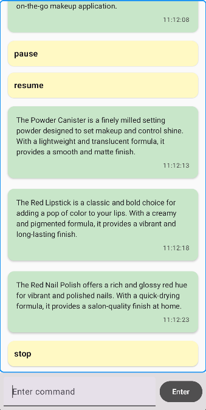

# Elements Feed Display (EFD)

## Preview

## Key Features
* **Command-Driven Feed**: Control the flow using the input field at the bottom (`start`, `stop`, `pause`, `resume`).
* **Intelligent Buffering**: While `pause` is active, data continues to fetch in the background and is "poured" into the list once `resume` is entered.
* **Auto-scroll**: The list automatically scrolls to the bottom whenever a new item (Product or Command) is added.
* **Modern UI**: Built entirely with **Jetpack Compose**, featuring Material 3 components.

##  How to Use
1. **Build and run** the app in Android Studio.
2. Type **`start`** in the input field to begin fetching the feed.
3. Use **`pause`** to stop visual updates while keeping the connection alive.
4. Use **`resume`** to display all buffered items collected during the pause.
5. Use **`stop`** to completely terminate the background job.

---
*Developed as a technical showcase for clean, library-free development.*